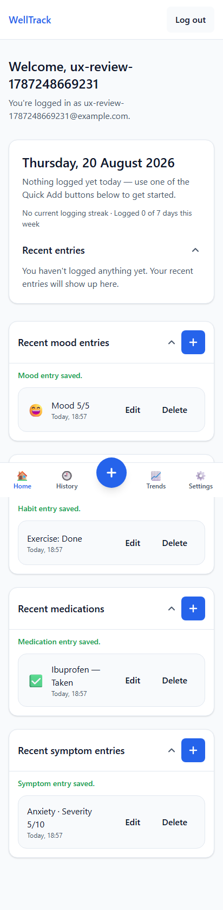
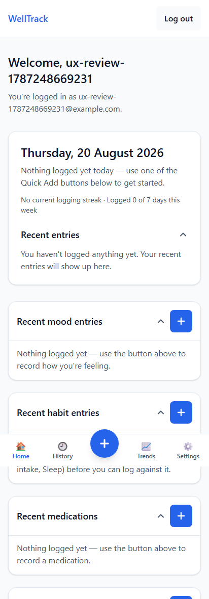
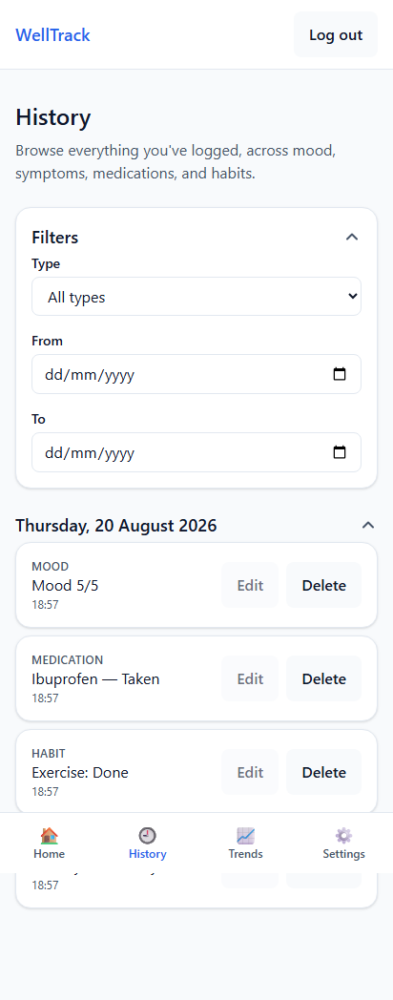
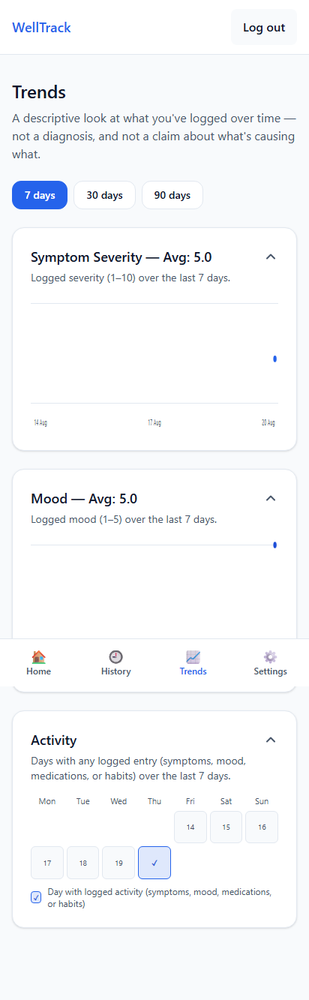
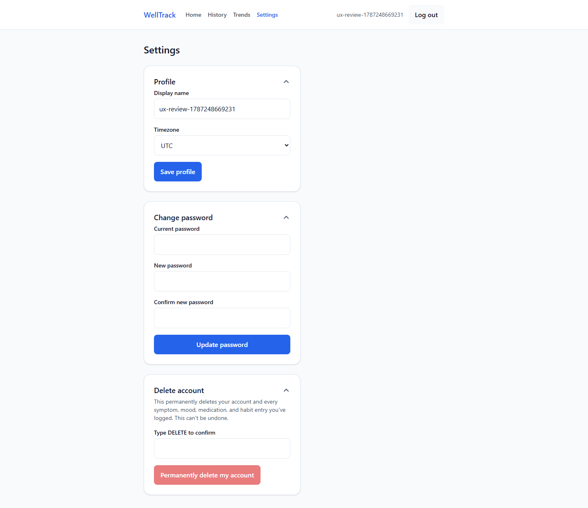
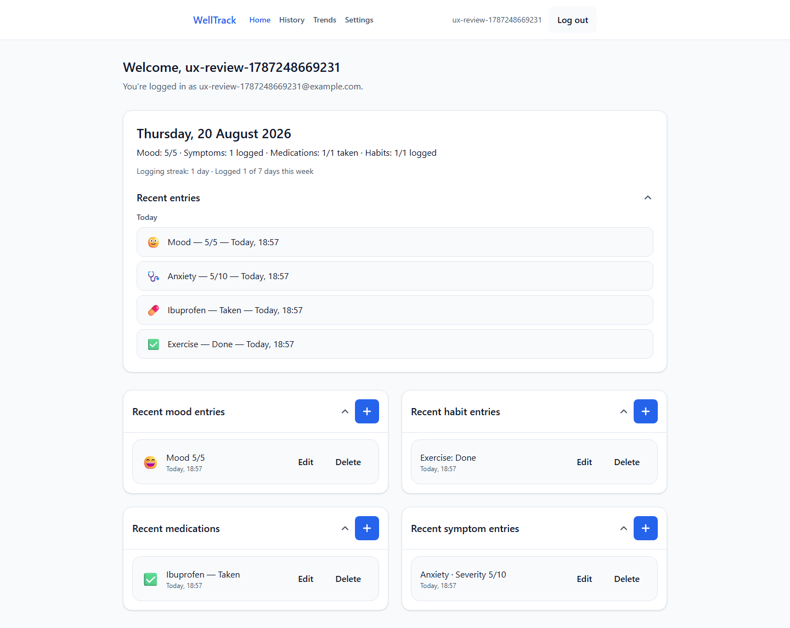
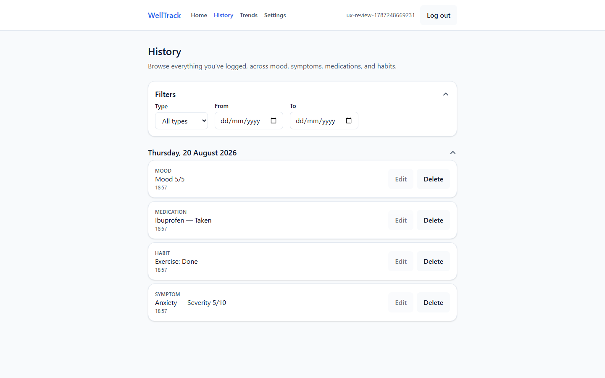
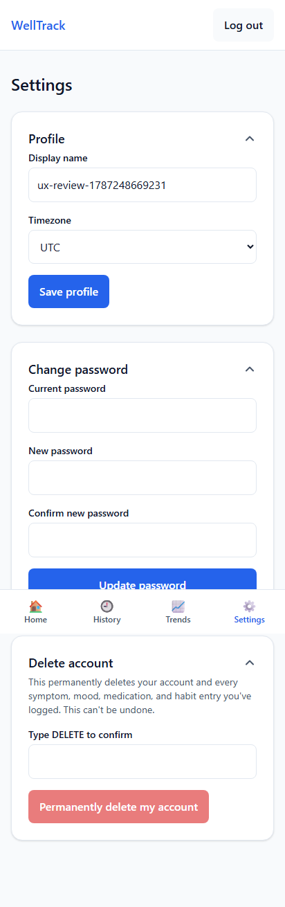
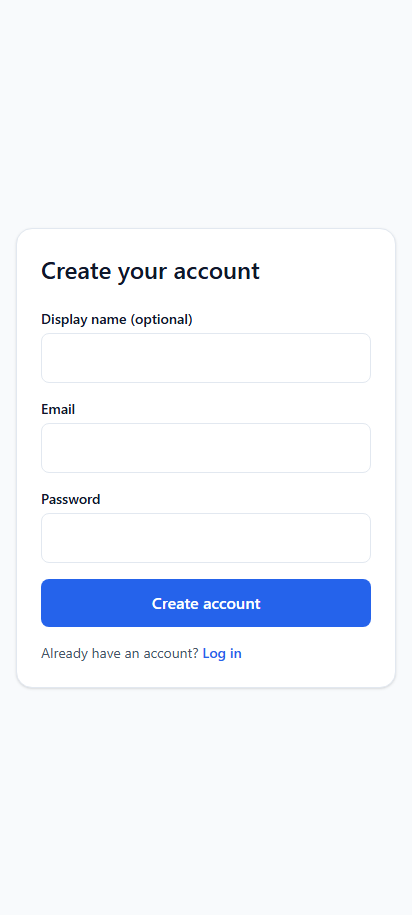
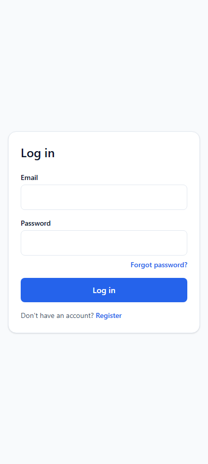

# WellTrack Design Review — 2026-08-20

A walkthrough of the live app as a first-time user would meet it — register, log one of
each entry type, browse History, check Trends, adjust Settings — compared against what a
user now expects by default from any 2026 web app, health-related or not. Screenshots
below are evidence from that actual walkthrough (mobile at 412×915, desktop at
1440×900), not illustrations.

**Status: mostly addressed.** Most of what this review found has since been fixed — see
the note under each finding for which PR closed it. Kept here as a record of what was
found and why, not just a stale to-do list.

## Summary

WellTrack's bones are good. The visual language is quiet and consistent on purpose — no
gamified streak badges, no alarmist color on a symptom severity chart, copy that
repeatedly refuses to imply diagnosis or causation. For an app aimed at people managing
chronic conditions, that restraint is the correct call, and it's applied consistently
across every screen, not just the marketing copy.

What was missing, at the time of this review, was the layer users now expect by default
from any web app: state that confirms itself instantly instead of a few seconds late,
empty states that coach rather than just announce, and a settings page that doesn't
waste three-quarters of a desktop monitor. None of the gaps below were exotic — they
were the table stakes a 2026 user has absorbed from every app they already use daily.

**Already met the bar at review time:**
- Mobile bottom nav / desktop top nav split, done properly
- Consistent collapsible-section language across every page
- Docked Quick Add — survives scroll without colliding with content
- Calm, non-alarmist tone; no gamification pressure
- Real keyboard/focus and touch-target accessibility work

**Fell short of 2026 norms at review time:**
- Charts that gave a single point the same canvas as thirty
- Desktop Settings and History ignored two-thirds of the viewport
- Editing worked in one view and was a dead button in another
- No dark mode, export, or reminders

---

## 01 — Feedback & motion

### A permanent "saved" message — correction

The original draft of this review flagged the green "Mood entry saved." confirmation as
a permanent message that never disappeared. **That finding was wrong, and worth
recording honestly rather than quietly fixing:** the app already had a self-clearing
`useTimedMessage` hook (4-second auto-clear), committed a full day before this review.
The verification script that produced the screenshot below logged four entries within
1–2 seconds of each other and screenshotted almost immediately after — well inside every
message's 4-second window — so the messages never had a chance to actually clear before
being observed. Reversing that mechanism (e.g. building a toast/snackbar system instead)
would have undone a deliberate, accessibility-motivated decision already recorded in
this project's own implementation log, not fixed a real bug.

*Dashboard, right after logging all four types — every message here was still inside its own 4-second window.*

### The headline summary didn't know what just happened

**Real finding, since fixed — see PR [#101](https://github.com/wheelyk/Wellbeing/pull/101).**

The top "Today" card polled on a 10-second interval, independent of the four Quick Add
sections below it. Log a mood entry and the section directly underneath updated
instantly — the card above it, three inches away, kept insisting "Nothing logged yet
today" for up to ten more seconds. Two pieces of the same screen visibly disagreed about
the same fact. Fixed by dispatching a shared "entry changed" event the summary card
listens for, refetching instantly instead of waiting out its own poll.

### Deleting an entry dropped to a native browser dialog

**Real finding, since fixed — see PR [#99](https://github.com/wheelyk/Wellbeing/pull/99).**

Delete was guarded by `window.confirm()` — the plain OS-styled dialog, not a component
that matched anything else on the page. Replaced with the app's own `Modal`-based
confirmation.

---

## 02 — Data at a glance

### One data point got the same canvas as thirty

**Real finding, since fixed — see PR [#98](https://github.com/wheelyk/Wellbeing/pull/98).**

With a single day logged, both Trends line charts rendered one dot pinned to the far
right edge of an otherwise empty plot — no gridlines, no shaded range, nothing signaling
"this chart works, you just haven't given it much to draw yet." Fixed with a distinct
sparse-data treatment: a faint dashed placeholder line plus a "Keep logging to see a
trend line here" caption, for the 1–2 point case specifically (0 points and 3+ points
were already handled correctly).

---

## 03 — Layout & space

### Settings pinned itself to a 384px column on a 1440px screen

**Real finding, since fixed — see PR [#100](https://github.com/wheelyk/Wellbeing/pull/100).**

Every card on Settings was capped by the same fixed-width component used for a login
form — appropriate for a single centered form, less so for a page with three independent
sections stacked vertically while roughly two-thirds of the browser window sat empty
beside them.

For comparison, Dashboard already did this correctly:

### History had the identical gap

**Real finding, since fixed — see PR [#99](https://github.com/wheelyk/Wellbeing/pull/99).**

---

## 04 — Editing your own data

### Edit worked, just not from the page called History

**Real finding, since fixed — see PR [#99](https://github.com/wheelyk/Wellbeing/pull/99).**

On Dashboard, each entry's own section card had a working Edit button, wired to the same
form used to create it. On History — the page explicitly framed as "browse everything
you've logged" — every Edit button was disabled, with a tooltip reading "Editing is
coming soon." A user correcting a typo in a symptom note had to know to leave the page
they were looking at data on and go find the same entry back on Dashboard instead.

**Known accepted tradeoff:** the fix duplicates some form-building logic that already
exists in the four Dashboard section components, rather than sharing it — a deliberate
choice made so this work and a parallel workstream could each proceed in their own
branch without a guaranteed file conflict. Extracting a shared edit-form component to
remove that duplication is a reasonable follow-up, not yet done.

---

## 05 — Table stakes

### No dark mode, despite the theming already being token-based

**Real finding, since fixed — see PR [#100](https://github.com/wheelyk/Wellbeing/pull/100).**

Every color in this codebase already routed through named Tailwind theme tokens
(`--color-brand`, `--color-surface`, and so on) rather than one-off hex values scattered
through components — exactly the groundwork a dark palette needs. Now has a real dark
palette (System/Light/Dark, localStorage-backed) reusing those same token names.

### No way out with your own data

**Real finding, since fixed — see PR [#100](https://github.com/wheelyk/Wellbeing/pull/100).**

Delete account was implemented carefully — typed confirmation, clear irreversibility
warning — with no equivalent "export everything first" option next to it. Now has one:
`GET /api/export` plus a Settings button that triggers a real download of everything the
user has logged.

### Nothing brings the user back — still open

A habit/symptom tracker's entire value compounds with consistent daily logging, and
nothing in the app currently prompts that — no reminder notification, no daily-digest
email, no "you usually log around 6pm" nudge. The streak counter on Dashboard quietly
assumes the user remembers on their own.

**Deliberately not built as part of the same pass as the other findings above.** Unlike
everything else in this review, a real reminder system needs infrastructure decisions
(which delivery channel — push vs. email, which provider, a scheduler) that are a
product/infra call, not something to bolt on unilaterally alongside a batch of UI fixes.
Still open as of this writing.

---

## If I had to pick three (at the time of this review)

1. **Make Edit consistent between Dashboard and History** — done, PR #99. Highest ratio
   of user-facing impact to actual engineering effort in this whole review, since the
   working version already existed elsewhere in the app.
2. **Fix the confirmation/feedback layer** — narrowed after the toast misdiagnosis above
   to just the summary-card refetch lag; done, PR #101.
3. **Give Settings and History a real desktop layout** — done, PR #99 (History) and
   PR #100 (Settings).
