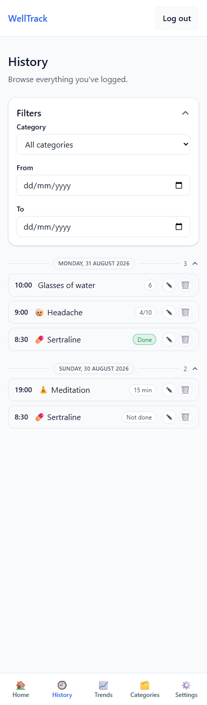
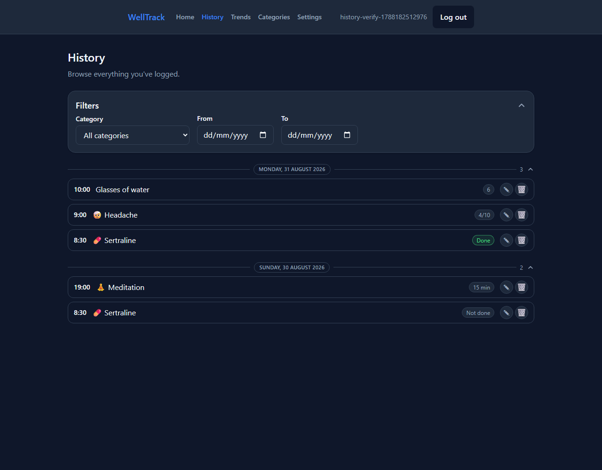

# History Page Redesign — 2026-08-31

A design proposal, approved and implemented the same day — see
[`docs/log/53-history-redesign.md`](../../log/53-history-redesign.md) for the implementation
record (backend field split, frontend restyle, tests, verification). This folder is the design
artifact itself: the interactive before/after mockup ([`mockup.html`](mockup.html) — also
[published live](https://claude.ai/code/artifact/8d514dcb-9c62-43dc-a3b4-3f86d7593d12), and saved
to Google Drive under Wellbeing/History Page Redesign) and real screenshots of the result.

## Why

Home's Timeline redesign ([task 49](../../log/49-timeline-panel.md)–[52](../../log/52-timeline-sync.md))
settled on a visual language — thin-rule day dividers, a leading time column, a muted pill for
state — that History never picked up. It still read as an older screen: bold text headers,
trailing timestamps, two boxy icon buttons per row.

## Before → after

**Before** (from the [2026-08-20 design review](../../design-review-2026-08-20/README.md)):

**After**, real screenshots of the shipped result — mobile, light:

...and desktop, dark:

## What changed, and why

Six moves, each one already established on Home — nothing invented for History specifically:

1. **Day headers become dividers.** `CollapsibleSection`'s bold-text-plus-chevron header
   replaced with the same thin-rule-plus-pill divider every Home day group uses. Collapsibility
   is kept — History spans weeks, unlike Home's single-day view — via a bespoke component that
   borrows Home's visual shape and adds a count and chevron to it.
2. **Time leads the row**, in a tabular-nums column, instead of sitting as a small trailing line
   under the label.
3. **The value becomes a pill** (backend change): `GET /api/history` used to return one
   pre-joined string (`"Sertraline: Done"`) — the exact thing this page's own code comment
   already flagged as wanting "a real field on the response instead." Split into
   `categoryName`/`categoryIcon`/`value` so the value can render as its own pill, the same way a
   Timeline row's "Logged"/"Done" state does.
4. **Pill color means outcome, not "is a pill."** "Done" gets Home's exact success-green pill.
   "Not done" and every numeric/scale/duration value stay neutral — an explicit "no," or a plain
   recorded number, isn't a failure the way a missed reminder is.
5. **A category icon, when there is one** — Home already shows a reminder's category icon;
   History's category is the same table, just hadn't been selecting the icon field.
6. **Edit/Delete shrink** to Home's own small circular icon-button sizing, instead of the
   previous full `Button`/`ActionButton` pair, which visually competed with the row's own
   content.

## General UI notes for the app

Beyond this one screen — see the mockup's own "General UI notes" section for the full list.
Highest priority: Timeline currently has two separate hand-copied pill-color palettes
(`PILL_TONE`, `TASK_PILL_TONE`) that happen to agree today because they were copied by hand;
History would have been a third. Worth pulling into one shared `StatusPill`/token map before a
future screen drifts.
